# Twitter da rapaziada

*Um projeto de fã*

## Como usar

### Configurando seu perfil ⚙️

1. Acesse o site do [Twitter da rapaziada](https://twitter-da-rapaziada.vercel.app).

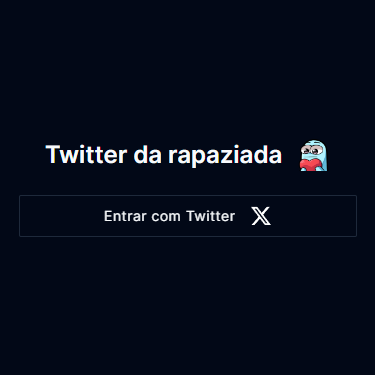

2. Clique em "*Entrar com Twitter*"

3. Agora, na pagina do twitter que será aberta, autorize o acesso ao seu perfil. Os únicos dados pegos da sua conta serão *seu nome*, *sua foto*, e *seu @*.

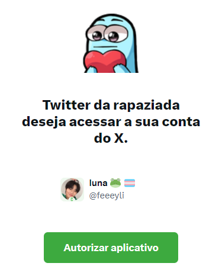

### Instalando o script no PC 🖥️

1. Acesse a [Chrome Web Store](https://chromewebstore.google.com/) e siga para o proximo passo, ou acesse a [pagina da extensão](https://chromewebstore.google.com/detail/violentmonkey/jinjaccalgkegednnccohejagnlnfdag) e pule para o passo 4.

2. Na barra de busca pesquise por "*ViolentMonkey*" e presione enter.

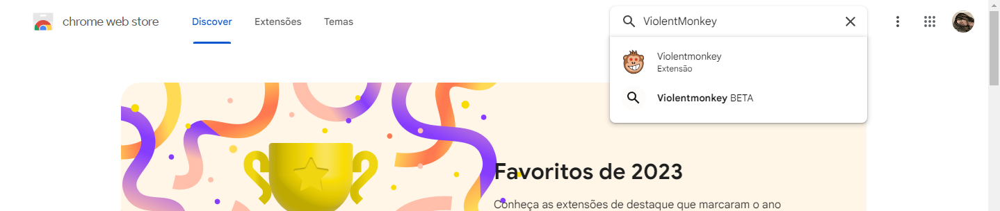

3. Escolha a versão padrão (sem o BETA).

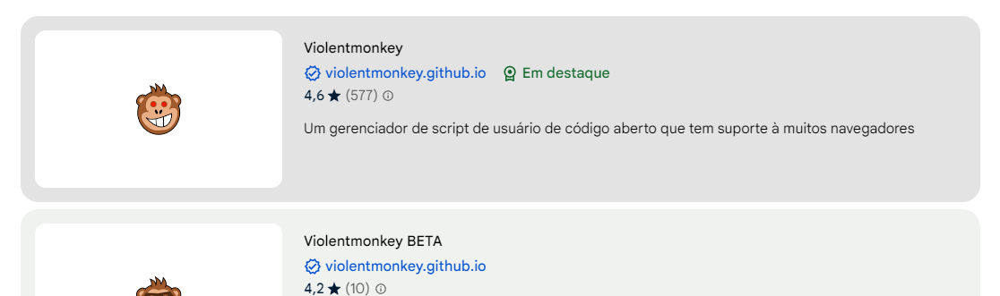

4. Instale a extensão clicando em "*Usar no Chrome*"

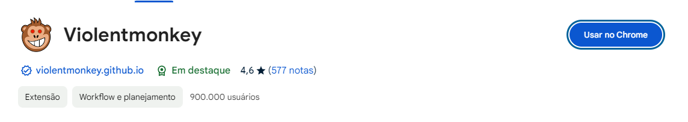

5. Acesse o [link do script](https://github.com/feeeyli/twitter-da-rapaziada/raw/main/index.user.js). Ao entrar nele a pagina do ViolentMonkey deverá aparecer. Por fim, clique em "*Install*"

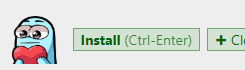

### Instalando o script no Celular 📱

1. Procure na google play o Kiwi Browser

🚨 Ele **NÃO** tem pra IOS, e como eu não tenho um iPhone não tenho como procurar uma alternativa 🚨

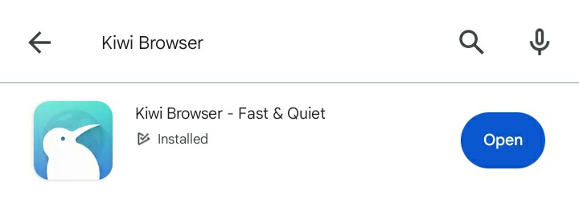

2. Instale o ViolentMonkey

    - Via link direto

      1. Acesse a [pagina da extensão](https://chromewebstore.google.com/detail/violentmonkey/jinjaccalgkegednnccohejagnlnfdag) pelo Kiwi Browser (copie o link e cole lá).

      2. Clique em "Usar no chrome"

          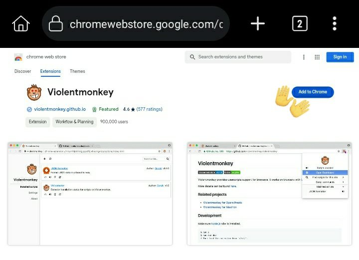

    - Via navegador

      1. Abra o Kiwi Browser, clique nos 3 pontinhos e clique em "*Extensões*"

          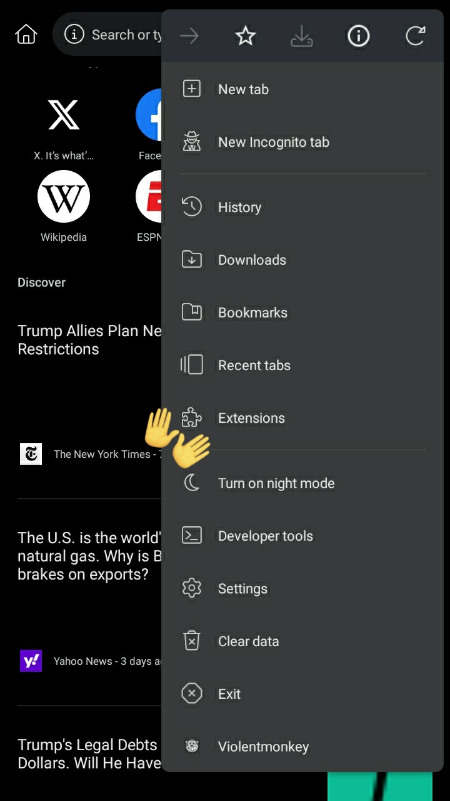

      2. Na tela que aparecer clique em "*+ (from store)*"

          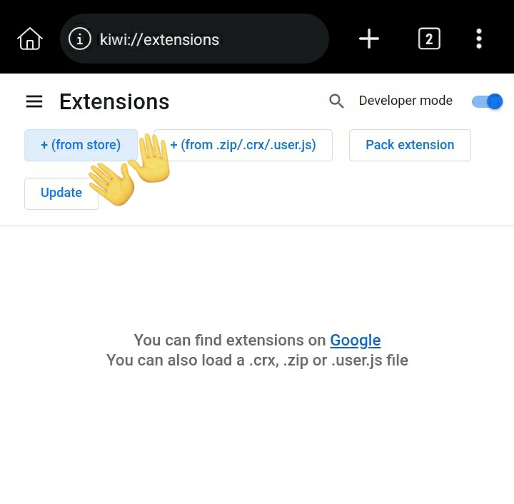

      3. Na Chrome Web Store clique na barra de busca e pesquise por "ViolentMonkey"

          

      4. Escolha a versão padrão (sem o BETA).

          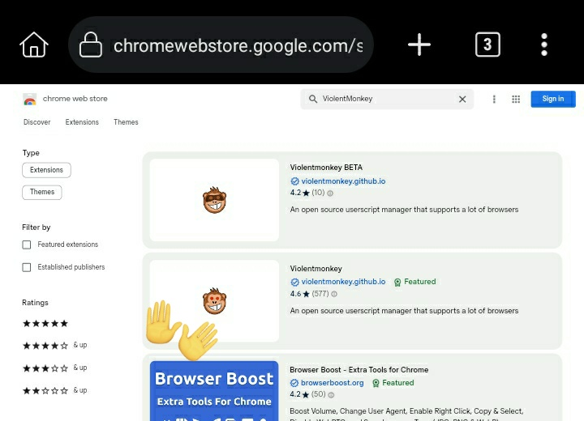

3. Acesse o [link do script](https://github.com/feeeyli/twitter-da-rapaziada/raw/main/index.user.js) pelo Kiwi Browser (copie o link e cole lá).

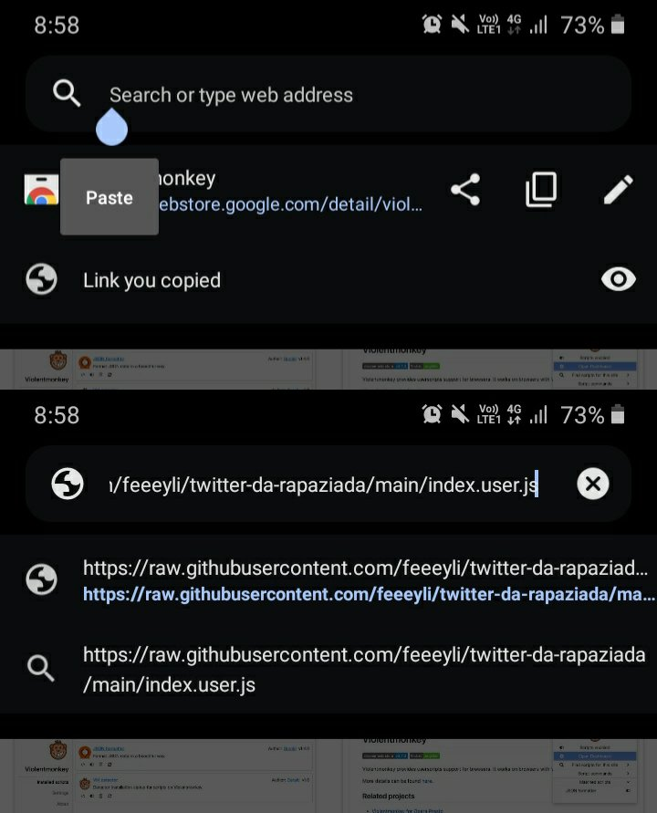

4. Ao entrar no link a pagina do ViolentMonkey deverá aparecer. Por fim, clique em "*Install*"

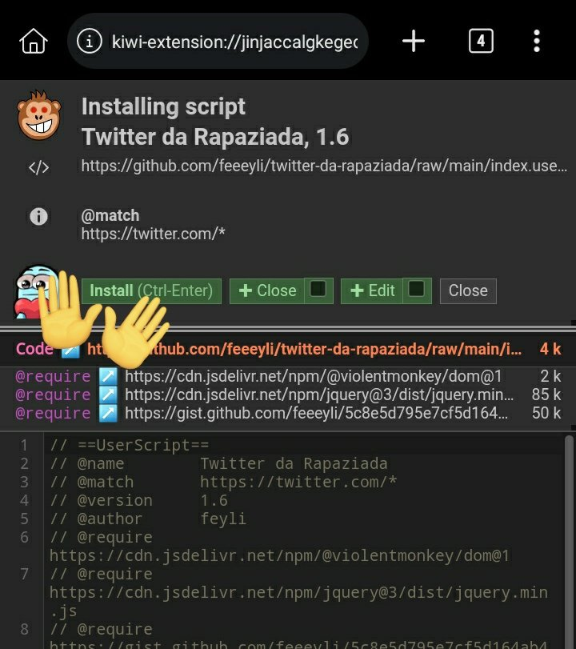